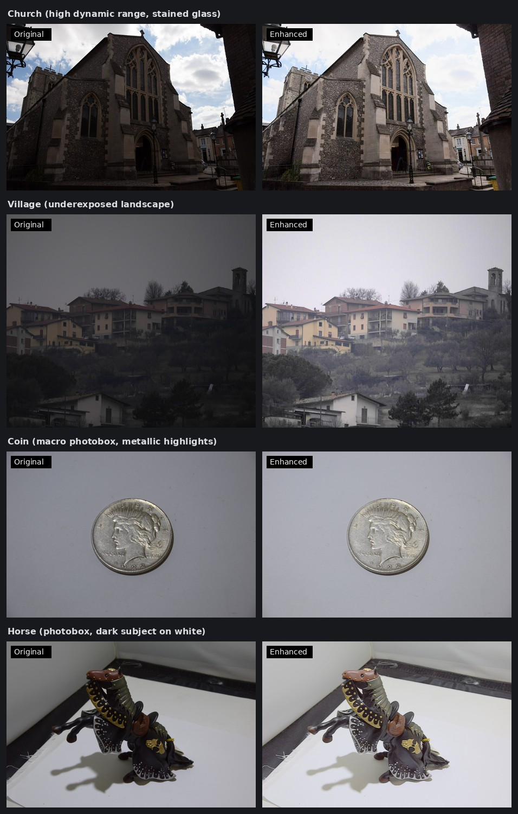

# adaptive-enhance

A small, standalone Rust toolset for correcting badly exposed photographs,
with no OpenCV or Python runtime dependency. It provides Unix-friendly commands
that read PNG data from standard input and write PNG data to standard output,
and a Rust library for enhancing decoded RGB buffers or in-memory PNG data.

The sibling [lightgpu inference engines](https://github.com/jacobsparts/lightgpu) -
[realesrgan-rs](https://github.com/jacobsparts/realesrgan-rs),
[rmbg-rs](https://github.com/jacobsparts/rmbg-rs),
[locate-anything-rs](https://github.com/jacobsparts/locate-anything-rs) and
[lama-inpaint-rs](https://github.com/jacobsparts/lama-inpaint-rs), and
[nafnet-rs](https://github.com/jacobsparts/nafnet-rs) - share the
[lightgpu](https://github.com/jacobsparts/lightgpu) CUDA toolkit. This toolset is
CPU-only and does not use it.
[pixeldeck](https://github.com/jacobsparts/pixeldeck) is a local web app for
cleaning up product photos that drives this toolset and all five engines.

Three binaries are built:

- **`adaptive-enhance`** - for **underexposed** images. It estimates the
  illumination, synthesises a brighter exposure and decides per pixel how much
  of it to use. Its blend is a highlight map that keeps the tone of the
  synthesised exposure above the point a clamped mix would flatten.
- **`iagcwd`** - for **overexposed** images. It corrects the intensity with the
  weighted histogram of an improved adaptive gamma curve, pulling an over-bright
  frame down while leaving hue and saturation alone.
- **`white-balance`** - for **mis-set white balance**. It measures the cast from
  the background of a photograph shot on a white sweep and scales each channel
  so that background becomes white, with an optional soft knee that keeps
  highlights from clipping.



## Build and run

A stable Rust toolchain (Rust 1.85 or newer) is required.

```console
git clone https://github.com/jacobsparts/adaptive-enhance.git
cd adaptive-enhance
cargo build --release

# Exposure fusion (the default), for underexposed images
./target/release/adaptive-enhance < input.png > enhanced.png

# The plain adaptive enhancement, without any fusion
./target/release/adaptive-enhance --adaptive < input.png > enhanced.png

# A brighter, flatter highlight map (default: auto-knee)
./target/release/adaptive-enhance -k 0.9 < input.png > enhanced.png

# Report illumination statistics and the exposure ratio
./target/release/adaptive-enhance --stats < input.png > enhanced.png

# Gamma correction for overexposed images
./target/release/iagcwd < input.png > corrected.png

# White balance from the background of a product photo
./target/release/white-balance < input.png > balanced.png

# The same, keeping specular highlights from clipping
./target/release/white-balance --safe < input.png > balanced.png
```

The command is pipe-oriented, so it composes with other programs:

```console
cat input.png | adaptive-enhance > enhanced.png
```

| option | meaning |
| --- | --- |
| `--fusion` | exposure fusion (default) |
| `--adaptive` | the plain adaptive enhancement |
| `-k`, `--knee <value>` | highlight-map knee, in `[0, 1)` (default: auto-knee) |
| `--stats` | illumination statistics and exposure ratio, on stderr |
| `-h`, `--help` | usage |
| `-V`, `--version` | version |

Errors are written to stderr and result in a non-zero exit status. No partial
PNG is written when processing fails.

### Supported PNG input

- grayscale and grayscale + alpha
- RGB and RGBA
- palette images
- 8-bit and 16-bit samples

Output is always 8-bit RGB or RGBA. Alpha is preserved unchanged. For 16-bit
input, each sample is reduced to its most significant byte before enhancement.
EXIF and other source metadata are not preserved.

## Library use

Enhance an interleaved 8-bit RGB buffer:

```rust
let enhanced = adaptive_enhance_fusion::adaptive_enhance_rgb(&rgb, width, height);
```

The input must contain exactly `width * height * 3` bytes in RGB order; the
returned buffer has the same layout and dimensions.

Or process a complete PNG in memory:

```rust
let output_png = adaptive_enhance_fusion::png_io::enhance_png(&input_png)?;
```

The exposure fusion framework (crate `adaptive-enhance-fusion`):

```rust
use adaptive_enhance_fusion::pipeline::{enhance_rgb, PipelineParams};

let params = PipelineParams::default();      // fusion.knee = 0.75
let output = enhance_rgb(&params, &rgb, width, height);
// output.rgb              fused 8-bit RGB
// output.illumination     the relative illumination map (f64, [0, 1])
// output.exposure_ratio   the k chosen by the entropy maximisation
```

The knee is a field of `FusionParams` (`params.fusion.knee`), defaulting to
`None` (auto-knee). When set to `Some(k)`, `k` is used directly without adjustment.

The PNG helpers return `Result<_, String>`. The lower-level RGB functions
assert that their dimensions and buffer length are valid.

## The enhancement

1. convert RGB to full-range HSV;
2. vertically filter the value channel with three 5x1 Gaussian kernels
   (`sigma = 15, 80, 250`) and average the results;
3. derive two candidate value channels from the mean saturation;
4. blend the candidates using the principal eigenvector of their 2x2 covariance
   matrix; and
5. replace the value channel and convert back to RGB.

Only luminance/value is adapted; hue and saturation are retained through the HSV
round trip. The arithmetic follows OpenCV, which the reference implementation is
built on: the 8-bit RGB to HSV conversion is OpenCV's fixed-point integer path,
the HSV to RGB conversion its `f32` path with round-half-to-even, and the blurs,
ratios and covariance are computed in `f64` (see `src/lib.rs`).

## Exposure fusion

1. normalise the image to `[0, 1]`;
2. estimate a relative illumination map `t` - the adaptive enhancement above,
   whose enhanced value channel is normalised and returned as that map;
3. synthesise an exposure `J = applyK(I, k*) - 0.01`, where
   `applyK(I, k) = I^(k^a) * exp((1 - k^a) * b)` with `a = -0.3293`,
   `b = 1.1258`, and `k*` maximises the entropy of `J` restricted to the
   under-exposed pixels `t < 0.5` (a golden-section search over `k` in `[1, 7]`);
4. decide, per pixel, how much of `J` to use - `W = 1 - t`, so a sample the
   estimator calls well lit is replaced by the synthesised exposure and a dark
   one keeps the original.

The entropy is computed on the `clip(value * 255) as u8` histogram, the `k`
search runs on a 50x50 `area`-resized copy of the normalised image with the
under-exposure mask `bicubic`-resized to the same size and thresholded at 0.5,
and the fused value is quantised by truncation of `clamp(value * 255, 0, 255)`.

### The highlight map

The synthesised exposure is not confined to `[0, 1]`: with the camera response
above, the sample at `I = 1` lands at `J = 1.58 .. 1.69` for every exposure
ratio the entropy search chooses, so the brightest part of a photograph carries
its tone in `J`'s out-of-range slope. Any blend that clamps `J` to the output
range flattens that band. `src/blend.rs` maps `J` instead, in four per-pixel
steps:

1. **Polarity.** `W = 1 - t`, so the output is `I * (1 - t) + mapped * t`.
2. **A tone map that does not clip.** `J`'s luminance is the identity below a
   knee and above it the straight line from `(knee, knee)` to
   `(J_max, CEILING)`, where `CEILING = 249/255` - four places below white, so
   the clipped and the merely bright stay distinguishable. Below the knee the
   rule is exactly the plain polarised mix.
3. **Colour above the knee.** Compressing luminance alone would raise chroma, so
   the channels are rebuilt around the mapped luminance,
   `mapped_c = g(L) + s * (J_c - L)`, with `s = min(room, cap)` bounded by the
   ceiling (`room`) and by the input's own chroma (`cap`), and `1.0` below the
   knee.
4. **The feather.** The `cap` term is a condition, so it is ramped in over a
   fraction of the headroom `J_max - knee` with a smoothstep on the argument.
   The join at the knee is C1 and the map, a `min` of two continuous functions,
   has no seam.

The knee is the one exposed parameter: the point where the map stops being the
identity, traded almost linearly against frame brightness.

To automatically adapt across both underexposed scenes (preventing overcast
skies from blowing out) and specular photobox scenes (preventing pale/metallic
surfaces from blooming), the effective knee is scaled by the scene's **diffuse
highlight ceiling** (the 98.5th percentile of RGB):
`effective_knee = knee * (diffuse_ceiling / 255)^2`.

- For natural scenes with full highlights, the diffuse ceiling is near 255, so
  the effective knee remains at `~0.77 - 0.80`.
- For underexposed scenes without true highlights, the knee automatically drops
  (e.g. `~0.13` on `homes`), preserving shadow richness and overcast sky tone.
- For pale objects in a photobox with specular sparks, the diffuse ceiling
  anchors to the object's body rather than the isolated glints, dropping the
  knee to `~0.26` to keep specular highlights crisp and unbloomed.

`CEILING` and the feather fraction are fixed, because the map's statistics are
defined in terms of the first and the second has no whole-frame effect.

### Recommended knee values

| knee | use case | description |
| --- | --- | --- |
| auto | general photos (default) | automatically adapts to scene dynamic range and diffuse highlights |
| `0.75` | fixed natural knee | balanced contrast and brightness for natural scenes |
| `0.20` | light subject in photobox | compresses earlier to protect highlights and preserve detail on pale objects |
| `0.95` | dark subject in photobox | lifts background toward white while retaining dark subject texture |

## iagcwd (for over-bright images)

The companion binary corrects a brightness-distorted image by measuring its mean
intensity against an expected average, choosing a path, and applying the inverse
CDF of a weighting distribution as a gamma curve (Cao et al., *Contrast
enhancement of brightness-distorted images by improved adaptive gamma
correction*, 2018). A dimmed image lifts, a bright one pulls down, and one
already near the average is copied through. On colour images only the value
channel changes, so hue and saturation survive.

```console
./target/release/iagcwd < overexposed.png > corrected.png
./target/release/iagcwd --stats < overexposed.png > corrected.png
```

| option | meaning |
| --- | --- |
| `--dim-alpha <value>` | weighting exponent of the dimmed path (default `0.75`; lower is stronger) |
| `--bright-alpha <value>` | weighting exponent of the bright path (default `0.25`) |
| `--target <value>` | expected average intensity (default `112`) |
| `--tau-t <value>` | relative deviation marking an image dimmed or bright (default `0.3`) |
| `--tau <value>` | inverse-CDF floor of the bright path (default `0.5`) |
| `--mode <mode>` | force a path: `dimmed`, `bright` or `none` |
| `--stats` | decision and correction statistics, on stderr |

The library entry points are `adaptive_enhance_fusion::iagcwd` (the algorithm)
and `adaptive_enhance_fusion::gray_png` (PNG I/O that keeps greyscale
greyscale).

## white-balance (for mis-set white balance)

A product photo on a white sweep is supposed to have a neutral white
background, but the camera and the light leave a cast in it, and every colour in
the frame inherits that cast. `white-balance` measures the cast from the
background and removes it by scaling each channel so that background's white
lands on 255.

The white point is measured from the **outer edge** of the image, where the
background is: the border strip is 5% of the shorter side, the brightest 1% of
those pixels by their largest channel is taken as the reference, and the
per-channel means of that reference are the white point. Reading only the border
keeps the subject out of the estimate; reading only the brightest 1% keeps a
shadow on the sweep out of it too.

```console
./target/release/white-balance < cast.png > neutral.png
./target/release/white-balance --safe < cast.png > neutral.png
./target/release/white-balance --stats < cast.png > neutral.png
```

| option | meaning |
| --- | --- |
| `-s`, `--safe` | roll the highlights into 255 instead of clipping them |
| `-k`, `--knee <value>` | point on the normalised range where `--safe` starts to roll off (default `0.5`) |
| `--stats` | measured white point, per-channel gains and clipped fraction, on stderr |

Every level is moved by the same per-channel gain and the top of the range
clips. With `--safe` the gain is followed by a soft knee that is the identity up
to the knee and then approaches 255 asymptotically, so a specular highlight
keeps its shape instead of blowing out to white. The knee is a fraction of the
white point rather than of the range, so it follows the background: with the
default of `0.5` the background itself lands just above the knee.

Both rules are applied through one lookup curve per channel, which is forced to
be monotone before it is used: a correction must never put a step in the output
that was not in the input, and a curve written level by level can. Output levels
are truncated rather than rounded.

The library entry point is `adaptive_enhance_fusion::white_balance`.

## Limitations

- PNG is the only encoded image format supported by the commands.
- The knee is the only strength-like control; the highlight map's feather has no
  knob by design.
- A perfectly flat image yields an all-zero illumination map, because the
  estimator normalises by the input's range.
- On a constant objective the exposure ratio search returns the end of its
  interval (`k = 7`); an output that looks unchanged may simply mean almost
  nothing was classified as under-exposed. `--stats` reports both.
- Enhancement is global and may make background texture more salient; evaluate
  the output against your own use case rather than applying it unconditionally.

## License

MIT, see [LICENSE](LICENSE).

## Inspiration

- [`adaptiveImageEnhancement()`](https://baidut.github.io/OpenCE/caip2017.html)
  from the OpenCE project (MIT), which the adaptive enhancement implements.
- Ying et al., *A New Image Contrast Enhancement Algorithm using Exposure
  Fusion Framework*, CAIP 2017, which the exposure fusion framework follows.
- Cao et al., *Contrast Enhancement of Brightness-Distorted Images by Improved
  Adaptive Gamma Correction*, 2018, which `iagcwd` implements.

See [NOTICE](NOTICE) for the original copyright notices.
